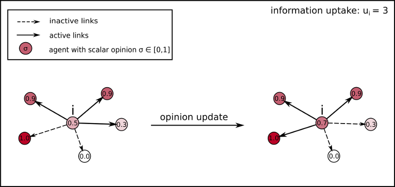

# COntent
A model of **C**ontinuous **O**pinion, Content Filtering and Bounded Information Uptake to describe the formation of echo chambers and filter bubbles in social networks.

## Description
The model describes the formation of opinions in social networks by considering content filtering and a bounded amount of information that can be processed (assigned as parameter **u**). The model is implemented as an agent based model. With the network structure and the parameter u as input variables. 

The algorithm reads:

1. Randomly choose an agent and its neighbors
2. Determine the **u** closest opinions of its neighbors
3. Take the mean of these **u** closest opinions and assign it to the chosen agent
4. Repeat the above steps until convergence is reached

The dynamics are visualized in the following figure:

## Model execution
The module 'COntent.py' defines the Model class. The model can be executed as shown in the 'COntent_run.py' script.
